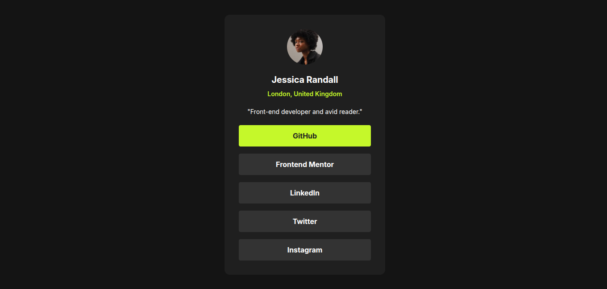

# Frontend Mentor - Social links profile solution

This is a solution to the [Social links profile challenge on Frontend Mentor](https://www.frontendmentor.io/challenges/social-links-profile-UG32l9m6dQ). Frontend Mentor challenges help you improve your coding skills by building realistic projects.

## Table of contents

- [Overview](#overview)
  - [The challenge](#the-challenge)
  - [Screenshot](#screenshot)
  - [Links](#links)
- [My process](#my-process)
  - [Built with](#built-with)
  - [What I learned](#what-i-learned)
  - [Continued development](#continued-development)
- [Author](#author)

## Overview

### The challenge

Users should be able to:

- See hover and focus states for all interactive elements on the page

### Screenshot

### Links

- Solution URL: [Git hub repo URL](https://github.com/frontend-rustyff12/03-fm-social-links-profile)

- Live Site URL: [Live site URL](https://social-links-profile-rustyff12.netlify.app/)

## My process

### Built with

- Semantic HTML5 markup
- CSS custom tailwind properties
- Flexbox
- Mobile-first workflow
- Tailwind CSS

### What I learned

Continuing to practice tailwind

### Continued development

I would add perhaps custom outlines for tab focus

## Author

- Frontend Mentor - [@rustyff12](https://www.frontendmentor.io/profile/rustyff12)
